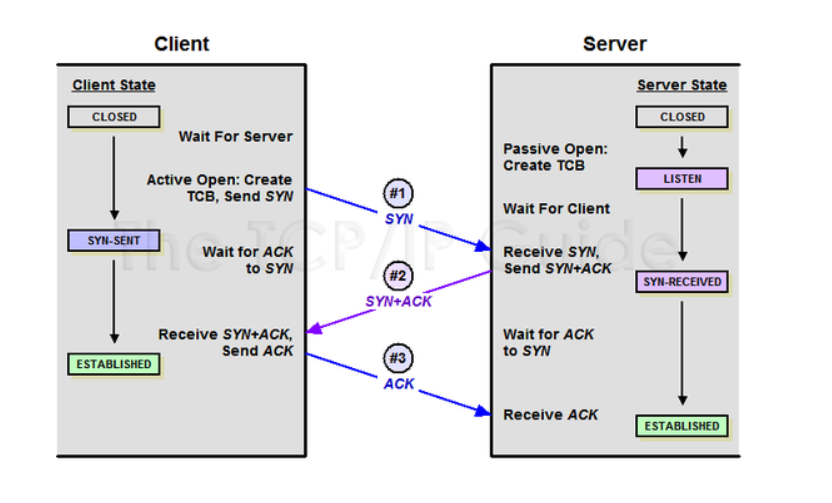
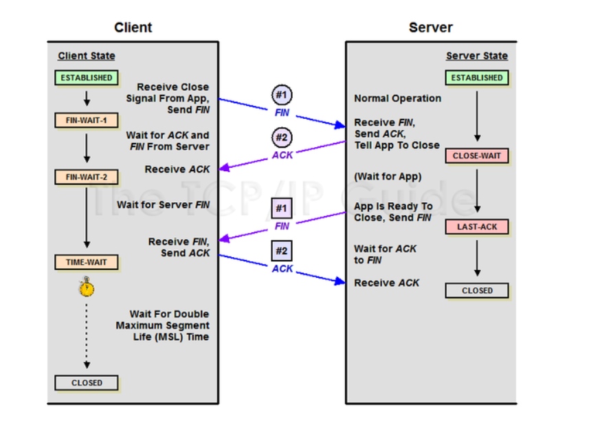

# HTTP GET과 POST 비교

둘 다 http 프로토콜을 이용해서 서버에 무엇인가를 요청할 때 사용하는 방식

## GET

- 요청하는 데이터가 http request message의 header 부분에 url이 담겨서 전송된다. 때문에 url 상에 ? 뒤에 데이터가 붙어 request를 보내게 된다.(query), 이러한 방식은 url이라는 공간에 담겨가기 때문에 전송할 수 있는 데이터의 크기가 제한적이다(256), 또 보안이 필요한 데이터에 대해서 데이터가 url에 노출된다는 문제점이 있다.

## POST

POST 방식의 request는 HTTP Request Message의 Body 부분에 데이터가 담겨서 전송된다.

때문에 바이너리 데이터를 요청하는 경우 POST 방식으로 보내야 하는 것처럼 데이터 크기가 GET 방식보다 크고 보안 면에서 낫다.

## 추가적인 차이점

- GET은 SELECT 적인 성향, POST는 서버의 값이나 상태를 변경하기 위해서 또는 추가하기 위해서 사용
- GET 방식의 요청은 브러우저에서 Caching 할 수 있다. 
  - POST 방식으로 요청할 것을 GET으로 요청한다면 서버가 아닌 기존에 caching 되었던 데이터가 응답될 가능성이 존재한다

# TCP 3-way, 4-way handshake

## 3-way handshaking

1. 클라이언트는 서버에 접속을 요청하는 SYN(a) 패킷을 전송
2. 서버는 클라이언트의 요청인 SYN(a)를 받고 요청을 수락한다는 ACK(a + 1), SYN(b) 패킷을 전송
3. 클라이언트는 서버의 요청 수락 응답인 ACK(a + 1)과 SYN(b)를 받고 ACK(b + 1)를 서버로 보내면 연결이 성립된다.

## 4-way handshaking

1. 클라이언트가 연결을 종료하겠다는 FIN 플래그 전송

2. 서버는 클라이언트의 요청 FIN을 받고 확인 메세지 ACK를 전송

   - 데이터를 모두 보낼 때까지 Time out

3. 서버에서 데이터를 모두 보내고 통신이 끝나면 연결이 종료되었다고 FIN 플래그를 클라이언트에 전송

4. 클라이언트는 FIN 메세지를 확인하고 ACK 를 전송

5. 클라이언트의 상태가 FIN-WAIT => TIME-WAIT로 바뀜

   - Server에서 FIN을 전송하기 전에 전송한 패킷이 라우팅 지연이나 패킷 유실로 인한 재전송과 같은 이유로 FIN패킷보다 늦게 전송되는 상황이 발생할 수 있다. 이런 경우에 패킷은 DROP되고 데이터는 유실될 것이다.

     => 이런 상황을 대비해, 클라이언트는 아직 서버로부터 받지 못한 데이터가 있을 것을 대비해 일정 시간 동안 세션을 남겨놓고 잉여 패킷을 기다리는 과정을 거친다.

# TCP와 UDP

## UDP

UDP(User Datagram Protocol, 사용자 데이터그램 프로토콜)

- 비연결형 프로토콜
- IP 데이터그램을 캡슐화하여 보내는 방법과 연결 설정을 하지 않고 보내는 방법을 제공
- 흐름제어, 오류제어, 손상된 세그먼트의 수신에 대한 재전송 x (사용자 프로세스의 몫)
- 포트들을 사용하여 IP 프로토콜에 인터페이스를 제공하는 것
- 종종 클라이언트는 서버로 짧은 요청을 보내고, 짧은 응답을 기대한다. 요청 또는 응답이 손시뢴다면, 클라이언트는 time out 되고 다시 시도할 수 있으면 된다.(TCP 초기설정에서 요구되는 프로토콜보다 적은 메세지가 요구)
- UDP를 사용한 것들에는 DNS가 있다. 호스트 네임의 IP 주소를 찾을 필요가 있는 프로그램은, DNS 서버로 호스트 네임을 포함한 UDP 패킷을 보낸다. 호스트의 IP 주소를 포함한 UDP 패킷으로 응답한다. 사전 설정x, 해제 필요 x

## TCP

TCP(Transmission Control Protocol, 전송제어 프로토콜)

- 대부분의 인터넷 응용 분야들은 신뢰성과 순차적인 전달을 필요로함, UDP로는 이를 만족시킬 수 없으므로 다른 프로토콜이 필요하여 탄생한 것이 TCP이다.
- 신뢰성이 없는 인터넷을 통해 종단간에 신뢰성이 있는 바이트 스트림을 전송하도록 설계
- 송신자와 수신자 모두가 소켓이라고 부르는 종단점을 생성함으로써 이루어진다.
- 모든 TCP 연결은 전이중(full-duplex), 점대점(point to point) 방식이다. 전이중이란 전송이 양방향으로 동시에 일어날 수 있음을 의미하며 점대점이란 각 연결이 정확히 2개의 종단점을 가지고 있음을 의미한다. TCP는 멀티캐스팅이나 브로드캐스팅을 지원하지 않는다.

## TCP, UDP 공통점

- 포트 번호를 이용하여 주소를 지정
- 데이터 오류 검사를 위한 체크섬 존재

## TCP, UDP 차이점

| TCP                               | UDP                                      |
| --------------------------------- | ---------------------------------------- |
| 연결이 성공해야 통신 가능(연결형) | 비연결형 프로토콜(연결 없이 통신이 가능) |
| 데이터의 경계를 구분하지 않음     | 데이터의 경계를 구분함                   |
| 신뢰성 있는 데이터 전송           | 비신뢰성 데이터 전송                     |
| 1:1(Unicast) 통신                 | 1:1, 1:N(Broadcast), N:M(Multicast) 통신 |

# HTTP와 HTTPS

## HTTP의 문제점

- HTTP는 평문 통신이기 때문에 도청이 가능(평문 => 암호화 입력으로 들어가는 정보)
- 통신 상대를 확인하지 않기 때문에 위장이 가능
- 완전성을 증명할 수 없기 때문에 변조가 가능

다른 암호화하지 않는 프로토콜에도 적용되는 문제점들

## TCP/IP는 도청 가능한 네트워크

TCP/IP 구조의 통신은 전부 통신 경로 상에서 엿볼 수 있다. 패킷을 수집하는 것만으로 도청할 수 있다. 평문으로 통신을 할 경우 메시지의 의미를 파악할 수 있기 때문에 암호화하여 통신해야 한다.

__보완 방법__

1. 통신 자체를 암호화 SSL(Secure Socket Layer) or TLS(Transport Layer Security)라는 다른 프로토콜을 조합함으로써 HTTP의 통신 내용을 암호화할 수 있다. SSL을 조합한 HTTP를 HTTPS or HTTP over SSL이라고 부른다.
2. 콘텐츠를 암호화, 말그대로 HTTP를 사용해서 운반하는 내용인, HTTP 메시지에 포함되는 콘텐츠만 암호화하는 것이다. 암호화해서 전송하면 받은 측에서는 그 암호를 해독하여 출력하는 처리가 필요하다.

## 통신 상대를 확인하지 않기 때문에 위장이 가능

HTTP에 의한 통신에는 상대가 누구인지 확인하는 처리가 없기 때문에 누구든지 리퀘스트를 보낼 수 있다. IP주소나 포트 등에서 그 웹 서버에 액세스 제한이 없는 경우 리퀘스트가 오면 상대가 누구든지 무언가의 리스폰스를 반환한다. 이러한 특징은 여러 문제점을 유발한다.

1. 리퀘스트를 보낸 곳의 웹 서버가 원래 의도한 리스폰스를 보내야 하는 웹 서버인지를 확인할 수 없다.
2. 리스폰스를 반환한 곳의 클라이언트가 원래 의도한 리퀘스트를 보낸 클라이언트인지를 확인할 수 없다.
3. 통신하고 있는 상대가 접근이 허가된 상대인지 확인할 수 없다.
4. 어디에서 누가 리퀘스트 했는지 확인할 수 없다.
5. 의미없는 리퀘스트도 수신한다. => DoS 공격을 방지할 수 없다.

__보완 방법__

위 암호화 방법으로 언급된 SSL로 상대를 확인할 수 있다. SSL은 상대를 확인하는 수단으로 증명서를 제공하고 있다. 증명서는 신뢰할 수 있는 제 3자 기관에 의해 발행되는 것이기 땜누에 서버나 클라이언트가 실재하는 사실을 증명한다. 이 증명서를 이용함으로써 통신 상대가 내가 통신하고자 하는 서버임을 나타내고 이용자는 개인 정보 누설 등의 위험성이 줄어들게 된다. 한 가지 이점을 더 꼽자면 클라이언트는 이 증명서로 본인 확인을 하고 웹사이트 인증에서도 이용할 수 있다.

## 완전성을 증명할 수 없기 때문에 변조가 가능하다

여기서 완전성이란 정보의 정확성을 의미한다. 서버 또는 클라이언트에서 수신한 내용이 송신 측에서 보낸 내용과 일치한다는 것을 보장할 수 없는 것이다. 리퀘스트나 리스폰스가 발신된 후에 상대가 수신하는 사이에 누군가에 의해 변조되더라도 이 사실을 알 수 없다. 이와 같이 공격자가 도중에 리퀘스트나 리스폰스를 빼앗아 변조하는 공격을 중간자 공격이라고 부른다.

__보완 방법__

MD5, SHA-1 등의 해시 값을 확인하는 방법과 파일의 디지털 서명을 확인하는 방법이 존재하지만 확실히 확인할 수 있는 것은 아니다. 확실히 방지하기 위해서는 HTTPS를 사용해야 한다. SSL에는 인증이나 암호화, 그리고 다이제스트 기능을 제공하고 있다.

## HTTPS 

HTTPS는 HTTP 통신하는 소켓 부분을 SSL or TLS라는 프로토콜로 대체하는 것 뿐이다. HTTP는 원래 TCP와 직접 통신했지만, HTTPS에서 HTTP는 SSL과 통신하고 SSL이 TCPㅗ아 통신하게 된다. SSL을 사용한 HTTPS는 암호화와 증명서, 안전성 보호를 이용할 수 있게 된다.

HTTPS의 SSL에서는 공통키 암호화 방식과 공개키 암호화 방식을 혼합한 하이브리드 암호 시스템을 사용한다. 공통키를 공개키 암호화 방식으로 교환한 다음에 다음부터의 통신은 공통키 암호를 사용하는 방식이다.

__모든 웹 페이지에서 HTTPS를 사용해도 될까?__

평문 통신에 비해서 암호화 통신은 CPU나 메모리 등 리소스를 더 많이 요구한다. 통신할 때마다 암호화를 하면 추가적인 리소스를 소비하기 때문에 서버 한 대당 처리할 수 있는 리퀘스트의 수가 상대적으로 줄어들게 된다.

하지만 최근에는 하드웨어의 발달로 인해 HTTPS를 사용하더라도 속도 저하가 거의 일어나지 않으며, 새로운 표준인 HTTP 2.0을 함께 이용한다면 오히려 HTTPS가 HTTP보다 빠르게 동작한다. 따라서 과거의 민감한 정보를 다룰 때만 HTTPS에 의한 암호화 통신을 사용하는 방식에서 현재 모든 웹 페이지에서 HTTPS를 적용하는 방향으로 바뀌어가고 있다.