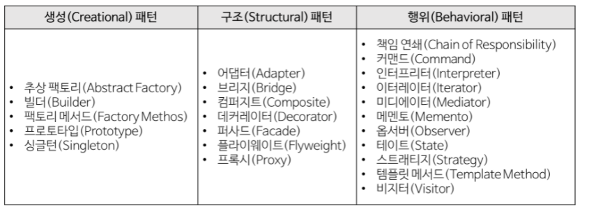
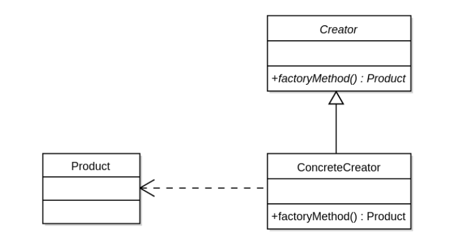

# 객체 지향 프로그래밍(Object Oriented Programming)

## 객체지향 프로그래밍이란

먼저 객체지향이란, 현실에 존재하는 `개체 Entity`를 `속성 Attribute`와 `메소드 Method`가 결합된 형태의 `객체 Object`로 표현하는 것

즉, 객체지향 프로그래밍은 프로그래밍에서 **필요한 데이터를 추상화시켜 속성과 행위를 가진 객체**를 만들고 그 **객체들 간의 유기적인 상호작용**을 통해 로직을 구성하는 프로그래밍 패러다임입니다.


## 객체지향 방식이란

객체지향 프로그래밍은 단지 이러한 객체의 디자인을 먼저 한 뒤에 이들의 데이터 플로우를 짜고, 진행 시나리오를 설계해나가는 방식의 `개발 방법론` 이다. 플로우차트 먼저 짜느냐, 데이터모델링을 먼저 하느냐의 차이 뿐이지 정해진 알고리즘을 따라 순서대로 실행되는 것은 마찬가지이다. 한 번에 프로그램 한 문장씩을 읽어 들여와서 실행시키는 폰 노이만 컴퓨터 구조를 사용하는 한, OOP라고 절차성을 무시하는 프로그램을 짤 수는 없습니다. 즉, `객체지향`과 `절차식`의 개념은 애초에 비교할 것이 아니라 다른 카테고리의 개념이다. 

`절차지향 프로그래밍은 프로그램의 순서와 흐름을 먼저 세우고 필요한 자료구조와 함수를 설계하는 방식이고, 객체지향 프로그래밍은 반대로 자료구조와 이를 중심으로 한 모듈들을 먼저 설계한 다음에 이들의 실행순서와 흐름을 짜는 방식이다.` 

## OOP SOLID - 객체지향 5원칙

좋은 객체지향 설계를 한다면 코드의 재사용, 유지보수의 용이성 면에서 개발에 필요한 비용을 줄일 수 있다. 작은 문제를 해결해서 큰 문제를 해결해가는 `Bottom-up` 방식. `Robert C. Martin`이 고안한 `SOLID 원칙`은 OOP를 잘 준수하기 위한 원칙이다.

### 단일 책임 원칙 (Single Responsibility Principle, SRP)

- 클래스(객체)는 하나의 책임/목적/역할만 지녀야 한다는 원칙
  - 새로운 기능을 기존 클래스에 `추가`하게 되면(==하나의 클래스가 여러 기능을 수행하면) 코드가 길어지고 복잡해지며 수정에 많은 시간이 소요됩니다.

### 개방-폐쇄 원칙(Open/Closed Principle)

- 클래스는 확장에는 개방되어 있지만 수정에는 폐쇄되어 있어야 한다.
  - 부모 클래스에서 자식 클래스를 만들 때 자식 클래스에서 기능을 추가/수정(`Overriding`)할 수 있지만, 자식을 위해 부모가 수정될 필요는 없습니다.

### 리스코프 치환 원칙 (Liskov's Substitution Principle, LSP)

- 자식 클래스는 언제나 자신의 부모 클래스를 교체할 수 있다는 원칙

  - 1987년 Barbara Liskov.
  - 부모 클래스의 위치에 자식 클래스로 넣어도 어떠한 issue도 없어야 한다는 원칙.

  ```
  도형 클래스가 있다고 가정하자.
  "도형은 둘레, 넓이, 각을 가진다."
  도형으로 사각형 클래스를 만들면,
  "사각형은 둘레, 넓이, 각을 가진다."
  도형으로 원 클래스를 만들면.
  "원은 둘레, 넓이, 각을 가진다."
  여기서 "각을 가진다" 부분이 어색해진다.
  따라서 도형 class는 LSP 원칙을 만족하지 못한 설계라고 할 수 있다.
  ```

### 인터페이스 분리 원칙 (Interface Segregation Principle, ISP)

- 클라이언트가 자신과 관련이 없는 인터페이스는 구현하지 않아아 한다는 원칙
  - 클래스는 자신이 사용하지 않는 메서드는 구현하지 않아야 합니다.
    - 일반 사용자 클래스에게 `게시판 폐쇄` 메서드가 있다면 권한이 없어 사용할 수 없을 것입니다. 이는 ISP를 만족하지 못합니다.

### 의존성 역전 법칙 (Dependency Inversion Principle, DIP)

- 고차원 module/class는 저차원 module/class에 의존하면 안된다는 원칙

  - 추상화는 세부사항에 의존해서는 안 되고, 세부사항은 추상화에 의존해야 합니다.

  ```
  예를 들어 자동차는 스노우타이어, 일반타이어, 광폭타이어와 같은 디테일한 개념보다,
  `타이어`라는 추상화된 개념에 의존하도록 설계되어야 합니다.
  ```

## 객체지향 언어의 특징

### 캡슐화 Encapsulation

데이터와 데이터를 처리하는 함수를 하나로 묶는 것

- 캡슐화된 객체와 세부 내용이 은폐되어, 변경이 발생할 때 오류의 파급 효과가 적으며, 재사용이 용이해집니다.
- 객체들 간에 메시지를 주고받을 때 각 객체의 세부 내용은 알 필요가 없으므로 인터페이스가 단순해지고, 객체 간의 결합도가 낮아집니다.

### 정보은닉 Information Hiding

캡슐화에서 가장 중요한 개념으로, 다른 객체에게 자신의 정보를 숨기고 자신의 연산만을 통하여 접근을 허용하는 것

- 각 객체의 수정이 다른 객체에게 주는 영향을 최소화하는 기술입니다.
- 외부 객체가 특정 객체의 데이터와 함수에 직접 접근하지 못하므로 유지보수와 소프트웨어 확장 시 오류를 최소화 할 수 있습니다.

### 추상화 Abstraction

불필요한 부분을 생략하고 객체의 `속성 Attribute` 중 가장 중요한 것에만 중점을 두어 개략화하는 것, 즉 객체화하는 것

- 완전한 시스템을 구축하기 전에 그 시스템과 유사한 모델을 만들어 여러 요인들을 테스트 할 수 있습니다.

### 상속성 Inheritance

이미 정의된 상위 클래스의 모든 속성과 메서드를 하위 클래스가 물려받는 것

- 상속성을 사용하면 하위 클래스는 상위 클래스의 속성과 메서드를 재정의하지 않아도 즉시 사용할 수 있습니다.
- 하위 클래스는 상위 클래스에 없는 새로운 속성과 메서드를 추가할 수 있습니다.
- 소프트웨어 재사용성을 증대합니다.

### 다형성 Polymorphism

객체가 연산을 수행하게 될 때 하나의 메시지에 대해 각 객체가 가지고 있는 고유한 방법으로 응답할 수 있는 것

- 객체들은 동일한 메서드명을 사용하며 같은 의미의 응답을 합니다.
- 응용 프로그램 상에서 하나의 함수나 연산자가 두 개 이상의 서로 다른 클래스의 인스턴스들을 같은 클래스에 속한 인스턴스처럼 수행할 수 있도록 하는 것을 말합니다.
- 1 + 2 = 3, A + B = AB


# RESTful API

REST란, REpresentational State Transfer의 약자이다. REST 의 기본 원칙을 성실히 지킨 서비스 디자인을 보고 RESTful하다고 한다.

REST는 하나의 아키텍처로 볼 수 있다. Resource Oriented Architecture이다. API 설계의 중심에 자원이 있고 HTTP Method를 통해 자원을 처리하도록 설계하는 것이다.


## RESTful 하게 API를 디자인한다는 것은

1. 리소스와 행위를 명시적이고 직관적으로 분리한다.
   - 리소스는 URI로 표현되는데 리소스가 가리키는 것은 명사로 표현되어야 한다.
   - 행위는 HTTP Method로 표현하고, GET(조회), POST(생성), PUT(기존 entity 전체 수정), PATCH(기존 entity 일부 수정), DELETE(삭제)을 분명한 목적으로 사용한다.
2. Message는 Header와 Body를 명확하게 분리해서 사용한다.
   - Entity에 대한 내용은 body에 담는다.
   - 애플리케이션 서버가 행동할 판단의 근거가 되는 컨트롤 정보인 API 버전 정보, 응답받고자 하는 MIME 타입 등은 header에 담는다.
   - header와 body는 http header와 http body로 나눌 수도 있고, http body에 들어가는 json 구조로 분리할 수도 있다.
3. API 버전을 관리한다.
   - 환경은 항상 변하기 때문에 API의 signature가 변경될 수도 있음에 유의해야 한다.
   - 특정 API를 변경할 때는 반드시 하위호환성을 보장해야 한다.
4. 서버와 클라이언트가 같은 방식을 사용해서 요청하도록 한다.
   - 브라우저는 form-data 형식의 submit으로 보내고 서버에서는 json 형태로 보내는 식의 분리보다는 json으로 보내든, 둘 다 form-data 형식으로 보내든 하나로 통일한다.
   - 다른 말로 표현하자면 URI가 플랫폼 중립적이어야 한다.

## 장점

1. Open API를 제공하기 쉽다.
2. 멀티플랫폼 지원 및 연동이 용이하다.
3. 원하는 타입으로 데이터를 주고 받을 수 있다.
4. 기존 웹 인프라(HTTP)를 그대로 사용할 수 있다.


## 단점

1. 사용할 수 있는 메서드가 4가지 밖에 없다
2. 분산환경에는 부적합하다
3. HTTP 통신 모델에 대해서만 지원한다.


# MVC 패턴


__Controller__

- 모델과 뷰를 연결하는 역할
- 클라이언트의 요청을 받았을 때, 그 요청에 대해 실제 업무를 수행하는 모델 컴포넌트를 호출한다. 클라이언트가 보낸 데이터가 있다면, 모델에 전달하기 쉽게 데이터를 가공한다. 모델이 업무를 마치면 그 결과를 뷰에 전달한다.


__Model__

- 어플리케이션이 무엇을 할지 결정
- 처리되는 알고리즘, DB 데이터 등등이 해당됨
- 컨트롤러가 호출할 때 요청에 맞는 역할을 수행한다. 비지니스 로직을 구현하는 영역으로 응용프로그램에서 데이터를 처리하는 부분이다.


__View__

- 화면에 무엇인가를 보여주기 위한 역할
- 컨트롤러로부터 받은 모델의 결과값을 가지고 사용자에게 출력할 화면을 만드는 일을 함


__동작과정__

1. 모든 input은 컨트롤러로 전달

2. 컨트롤러는 인풋을 확인하고 모델을 업데이트

3. 업데이트 결과에 따라 뷰를 선택

4. 컨트롤러와 뷰는 1:N

5. view는 모델을 이용하여 화면을 나타냄
   1. view가 모델을 직접 이용하여 업데이트
   2. 모델이 뷰에게 notify하여 업데이트
   3. view가 pooling하여 모델의 변화를 감지하여 업데이트

이와 같은 방식으로 동작하기 때문에 뷰와 모델 사이에는 의존성이 있다.


# MVVM 패턴

__Model__

- 어플리케이션에서 사용되는 데이터와 그 데이터를 처리하는 부분


__View__

- 사용자에게 보여지는 UI 부분


__View Model__

- 뷰를 표현하기 위해 만든 뷰를 위한 모델, 뷰를 나타내기 위한 데이터 처리를 하는 부분


__동작과정__

1. view를 통해 사용자의 액션이 들어옴
2. command 패턴으로 view 모델에 action을 전달
3. 뷰 모델은 모델에게 데이터를 요청
4. 모델은 요청받은 데이터를 응답
5. 뷰 모델은 응답 받은 데이터를 가공하여 저장
6. 뷰는 뷰 모델과 데이터 바인딩하여 화면을 나타냄


__Command 패턴__

- 요청을 객체의 형태로 캡슐화하여 사용자가 보낸 요청을 나중에 이용할 수 있도록 매서드 이름, 매개변수 등 요청에 필요한 정보를 저장 또는 로깅, 취솧라 수 있게 하는 패턴


__Data Binding__

- 데이터 소스를 묶고 동기화 하는 작업


__++__

- View Model과 View는 1:N 관계
- MVVM 패턴은 뷰와 모델 사이의 의존성이 없다. 또한 Command 패턴과 데이터 바인딩을 이용하여 뷰와 뷰 모델 사이의 의존성도 없앤 디자인 패턴. 각각의 부분은 독립적이기 때문에 모듈화하여 개발할 수 있다.


# 디자인 패턴

## 디자인 패턴이란

- 과거 소프트웨어 개발 과정에서 발견한 설계 노하우를 재사용하기 좋은 형태로 특정 규약을 만들어서 정리한 것


## 장점

- 범용적인 코드 스타일로 의사소통을 효율적으로 할 수 있음
- 검증된 구조이므로 설계를 빠르게 할 수 있다.


## 분류



1. 생성 패턴
   - 객체 생성에 관련된 패턴
   - 객체의 생성과 조합을 캡슐화 해 특정 객체가 생성되거나 변경되어도 프로그램 구조에 영향을 크게 받지 않도록 유연성을 제공한다.
2. 구조 패턴
   - 클래스나 객체를 조합해 더 큰 구조를 만드는 패턴
   - 여러 기능을 하는 객체를 묶어 하나의 새로운 기능으로 제공하는 패턴
3. 행위 패턴
   - 객체나 클래스 사이의 알고리즘이나 책임 분배에 관련된 패턴
   - 한 객체가 혼자 수행할 수 없는 작업을 여러 개의 객체로 어떻게 분배하는지, 또 그렇게 하면서도 객체 사이의 결합도를 최소화하는 것에 치중함


## 주요 패턴

__싱글톤 패턴__

- 애플리케이션에서 인스턴스를 하나만 만들어 사용하기 위한 패턴
- 커넥션 풀, 스레드 풀, 디바이스 설정 객체 등의 경우, 인스턴스를 여러 개 만들게 되면 자원을 낭비하게 되거나 버그를 발생시킬 수 있으므로 오직 하나만 생성하고 그 인스턴스를 사용하도록 하기 위해 사용한다.

**스레드 풀

- 프로세스 중 병렬 작업 처리가 많아지면 스레드 개수가 증가되고 그에 따른 스레드 생성과 스케줄링으로 인해 메모리 사용량이 늘어나고 시스템 성능이 저하가 된다.
- 이러한 현상을 막기 위해서 스레드 풀은 스레드를 제한된 개수만큼 정해놓고 작업큐에 들어온 작업들을 하나씩 스레드가 맡아 처리한다.


**커넥션 풀

- 스레드 풀과 비슷
- db와 연결할 때마다 커넥션 객체를 생성하면 비효율적이기 때문에 pool이란 곳에 객체를 생성해두는 것

- 초기화 방법:

  - 이른 초기화: 이른 초기화 방식은 싱글톤 객체를 미리 생성해 놓는 방식, 항상 싱글톤 객체가 필요하거나 생성비용이 크게 들어가지 않는 경우에 사용

  - 게으른 초기화: 클래스의 인스턴스가 사용되는 시점에서 싱글톤 인스턴스를 생성하는 방식

    - thread-safeness함

      => 보완1, synchronized 키워드 사용 => 내부적으로 해당 영역이나 메서드를 lock, unlock 처리하기 때문에 내부적으로 많은 cost 발생

      => 보완2, Double check 사용 => instance가 null인지 체크 + synchronized 블럭의 instance가 null인지 체크 => 둘 다 null이면 인스턴스화, 성능 저하 방지

  - 홀더에 의한 초기화: 클래스 안에 클래스(holder)를 두어 jvm의 class loader 매커니즘과 class가 로드되는 시점을 이용한 방법, 게으른 초기화 방식을 가져가면서 스레드 간 동기화 문제를 해결


__팩토리 메서드 패턴__

- 객체를 직접 생성하지 않고 객체를 생성하는 팩토리 객체를 사용하는 패턴

- 장점: 직접 객체를 생성하는 것을 막아줘서 결합도를 낮춰주는 효과가 있음(유지보수 용이)



__어댑터 패턴__

- 어댑터를 사용하여 호환되지 않는 인터페이스를 호환되도록 하는 패턴
- 향후에 인터페이스가 바뀌더라도 변경된 내용이 어댑터 안에 캡슐화되므로 수정할 필요가 없음


__템플릿 메소드 패턴__

- 상속을 통해 부모 클래스의 기능을 확장할 때 사용
- 부모 클래스에서 변하지 않는 기능을 구현해두고 자식 클래스에서 확장할 기능을 구현


__옵저버 패턴__

- 객체의 상태 변화를 관찰하는 관찰자들, 옵저버들의 목록을 객체에 등록하여 상태 변화가 있을 때마다 메서드 등을 통해 객체가 직접 목록의 각 옵저버에게 통지하도록 하는 디자인 패턴
- 어떤 객체의 변경 사항이 발생하였을 때 이와 연관된 객체들에게 알려주는 디자인 패턴
- 장점
  - 실시간으로 한 객체의 변경사항을 전파할 수 있다.
  - 느슨한 결합으로 시스템이 유연하고 객체 간의 의존성을 제거할 수 있다.
- 단점
  - 개수가 많아지면 상태 관리가 힘들다
- ex) MVC 패턴에서 각 모델에 등록된 모든 뷰를 기억하도록 구성, 모델의 상태가 바뀌면 해당 모델에 등록된 모든 뷰에 이를 update 할 수 있다.