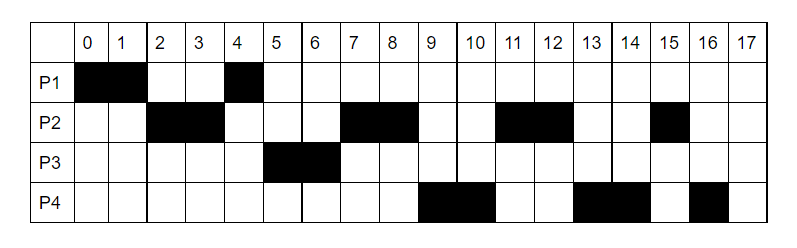
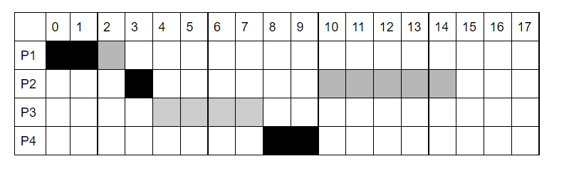
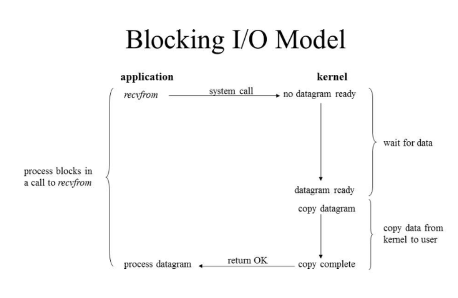
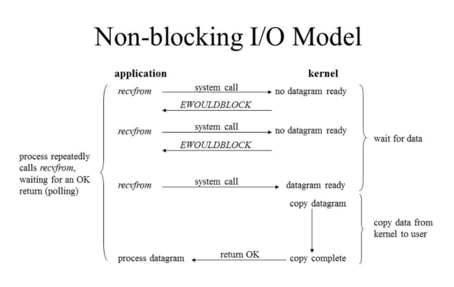
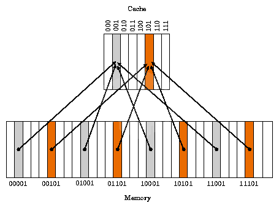

# 프로세스와 스레드

## 프로세스(Process)

프로세스는 실행 중인 프로그램으로 디스크로부터 메모리에 적재되어 CPU의 할당을 받을 수 있는 것을 말한다. 운영체제로부터 주소 공간, 파일, 메모리 등을 할당받으며 이것들을 총칭하여 프로세스라고 한다. 

메모리는 다음 4가지 영역들로 이루어져 있다.

- Code: 실행 명령을 포함하는 코드들
- Data: Static 변수 혹은 Global 변수
- Heap: 동적 메모리 영역
- Stack: 지역변수, 매개변수, 반환 값 등등 일시적인 데이터

__프로세스 제어 블록(PCB)__

PCB는 특정 프로세스에 대한 중요한 정보를 저장하고 있는 운영체제의 자료구조이다. 운영체제는 프로세스를 관리하기 위해 프로세스의 새성과 동시에 고유한 PCB를 생성한다. 프로세스는 CPU를 할당받아 작업을 처리하다가도 프로세스 전환이 발생하면 진행하던 작업을 저장하고 CPU를 반환해야 하는데, 이 때 작업의 진행 상황을 모두 PCB에 저장하게 된다. 그리고 다시 CPU를 할당받게 되면 PCB에 저장되어 있던 내영을 불러와 이전에 종료했떤 시점부터 다시 작업을 수행한다.

_PCB에 저장되는 정보_

- 프로세스 식별자(Process ID): 프로세스 식별번호
- 프로세스 상태: new, ready, running, waiting, terminated 등의 상태를 저장
- 프로그램 카운터: 프로세스가 다음에 실행할 명령어의 주소
- CPU 레지스터
- CPU 스케쥴링 정보: 프로세스의 우선순위, 스케줄 큐에 대한 포인터 등
- 메모리 관리 정보: 페이지 테이블 또는 세그먼트 테이블 등과 같은 정보를 포함
- 입출력 상태 정보: 프로세스에 할당된 입출력 장치들과 열린 파일 목록
- 어카운팅 정보: 사용된 CPU 시간, 시간제한, 계정번호 등

## 스레드(Thread)

스레드는 프로세스의 실행 단위라고 할 수 있다. 한 프로세스 내에서 동작되는 여러 실행 흐름으로 프로세스 내의 주소 공간이나 자원을 공유할 수 있다. 스레드 ID, 프로그램 카운터, 레지스터 집합, 스택으로 구성된다. 하나의 프로세스를 다수의 실행 단위로 구분하여 자원을 공유하고 자원의 생성과 관리의 중복성을 최소화하여 수행 능력을 향상시키는 것을 멀티스레딩이라고 한다.

__스택을 스레드마다 독립적으로 할당하는 이유?__

스택은 함수 호출시 전달되는 인자, 되돌아갈 주소값 및 함수 내에서 선언하는 변수 등을 저장하기 위해 사용되는 메모리 공간이다. 이를 독립적으로 할당한다는 것은 독립적인 함수 호출이 가능하다는 것이고 이는 독립적인 실행 흐름이 추가된다는 것, 따라서 최소 조건으로 독립된 스택을 할당

__PC Register를 스레드마다 독립적으로 할당하는 이유__

PC값은 스레드가 명령어의 어디까지 수행하였는지를 나타나게 된다. 스레드는 CPU를 할당 받았다가 스케줄러에 의해 다시 선점당한다. 그렇기 때문에 명령어가 연속적으로 수행되지 못하고 어느 부분까지 수행했는지 기억할 필요가 있다. 따라서 PC 레지스터를 독립적으로 할당

## 문맥 전환(Context Switching)

여러 개의 작업이 이루어질 때 동시에 이루어지는 것이 아니라 CPU를 시분할하여 각 프로세스를 번갈아가며 실행한다.

## 멀티 프로세스 & 멀티 스레드

__멀티 프로세스__

- 각 프로세스는 독립적
- IPC를 사용한 통신
- 자원 소모적이며 개별 메모리 차지
- Context Switching 비용이 큼
- 동기화 작업이 필요하지 않음
- 안정성이 높다.

__멀티 스레드__

- Thread끼리 긴밀하게 연결되어 있음
- 공유된 자원으로 통신 비용 절감
- 공유된 자원으로 메모리가 효율적
- Context Switching 비용이 적음(캐시 메모리를 비울 필요가 없기 때문)
- 공유 자원 관리 필요(동기화)

**동기화: 프로세스 또는 스레드들이 수행되는 시점을 조절하여 서로가 알고 있는 정보가 일치하는 것

# 스케줄러

프로세스를 스케줄링하기 위한 큐에는 세 가지 종류가 존재

- Job Queue: 현재 시스템 내에 있는 모든 프로세스의 집합
- Ready Queue: 현재 메모리 내에 있으면서 CPU를 잡아서 실행되기를 기다리는 프로세스 집합
- Deice Queue: Device I/O 작업을 대기하고 있는 프로세스의 집합

각각의 Queue에 프로세스들을 넣고 빼주는 스케줄러에도 크게 세 가지 종류가 존재

## 장기스케줄러(Long-term scheduler or job scheduler)

메모리는 한정되어 있는데 많은 프로세스들이 한꺼번에 메모리에 올라올 경유, 대용량 메모리에 임시로 저장된다. 이 pool에 저장되어 있는 프로세스 중 어떤 프로세스에 메모리를 할당하여 ready queue로 보낼지 결정하는 역할

- 메모리와 디스크 사이의 스케줄링을 담당
- 프로세스에 메모리 및 각종 리소스를 할당
- 실행 중인 프로세스의 수 제어
- 프로세스의 상태 new -> ready(in memory)

** 메모리에 프로그램이 올라가는 수가 과하거나 부족하면 성능이 좋지 않음

## 단기스케줄러(short-term scheduler or CPU scheduler)

- CPU와 메모리 사이의 스케줄링을 담당
- Ready Queue에 존재하는 프로세스 중 어떤 프로세스를 running 시킬지 결정
- 프로세스에 CPU를 할당
- 프로세스의 상태 ready => running => waiting => ready

## 중기 스케줄러(Medium-term scheduler or Swapper)

- 여유 공간 마련을 위해 프로세스를 통째로 메모리에서 디스크로 쫓아냄
- 프로세스에서 memory dealocate
- 실행 중인 프로세스 수의 제어
- 현 시스템에서 메모리에 너무 많은 프로그램이 동시에 올라가는 것을 조절하는 스케줄러
- 프로세스의 상태 ready => suspended

__suspended란__

- 외부적인 이유로 프로세스의 수행이 정지된 상태로 메모리에서 내려간 상태를 의미
- 프로세스 전부 디스크로  swap out
- blocked 상태는 다른 I/O 작업을 기다리는 상태라 스스로 ready 상태로 돌아갈 수 있지만 suspended는 스스로 돌아갈 수 없다.

# CPU 스케줄러

스케줄링 대상은 Ready Queue에 있는 프로세스들

## 1. 선점형 스케줄링

하나의 프로세스가 CPU를 차지하고 있을 때, 우선순위가 높은 다른 프로세스가 현재 프로세스를 중단시키고 CPU를 점유하는 스케줄링 방식

- 장점: 비교적 빠른 응답, 대화식 시분할 시스템에 적합
- 단점: 높은 우선순위 프로세스들이 들어오는 경우 오버헤드 발생

__라운드 로빈(Round Robin)__

- 프로세스는 같은 크기의 CPU 시간을 할당한다. 프로세스가 할당된 시간 내에 처리 완료를 모샇면 준비 큐 리스트의 가장 뒤로 보내지고,  CPU는 대기 중인 다음 프로세스로 넘어간다.

- 특징: 균등한 CPU 점유시간, 시분할 시스템 이용

- 할당된 시간량이 커지면 FCFS와 같아지고 작아지면 잦은 context switching으로 인해 오버헤드가 발생한다. 

  다음과 같이 프로세스의 도착 시간과 서비스 시간이 주어졌다고 가정

| 프로세스 | 도착 시간 | 서비스 시간 |
| -------- | --------- | ----------- |
| P1       | 0         | 3           |
| P2       | 1         | 7           |
| P3       | 3         | 2           |
| P4       | 5         | 5           |

- 라운드 로빈 스케줄링(선점, 시간할당량 = 2 인 경우)

__SRTF(Shortest Remaining Time First)__

- 가장 짧은 시간이 소요되는 프로세스를 먼저 수행하고, 남은 처리 시간이 더 짧다고 판단되는 프로세스가 Ready Queue에 생기면 언제라도 프로세스가 선점되는 방식

- startvation이 나타날 수 있음

- SRTF 스케줄링 예시(선점)

  

__다단계 큐(Multi Level Queue)__

- 작업들을 여러 종류 그룹으로 분할한 뒤 여러 개의 큐를 이용하여 상위 단계 작업에 의한 하위 단계 작업이 선점되는 방식
- 각 큐는 자신만의 독자적인 스케줄링을 가진다.

__다단계 피드백 큐(Multi Level Feedback Queue__

- 입출력 위주와 CPU 위주인 프로세스의 특성에 따라 큐마다 서로 다른 CPU 시간 할당량을 부여
- FCFS(FIFO)와 라운드 로빈 스케줄링 기법을 혼합한 것, 새로운 프로세스는 높은 우선순위, 프로세스의 실행시간이 길어질 수록 점점 낮은 우선순위 큐로 이동하고 마지막 단계에서는 라운드 로빈 방식을 적용

## 2. 비선점형 스케줄링

한 프로세스가 CPU를 할당받으면 작업 종료 후 CPU 반환 시까지 다른 프로세스는 CPU 점유가 불가능한 스케줄링 방식

- 장점: 응답시간 예상이 쉬움, 모든 프로세스에 대한 요구를 공정하게 처리
- 단점: 짧은 작업을 수행하는 프로세스가 긴 작업 종료시까지 대기해야 하는 일이 발생

__우선순위(Priority)__

- 프로세스 별로 우선순위가 주어지고, 우선순위에 따라 CPU를 할당
- 동일 순위는 FCFS

__기한부(Deadline)__

- 작업들이 명시된 시간이나 기한 내에 완료되도록 계획

__FCFS(First Come First Service)__

- 프로세스가 대기 큐에 도착한 순서에 따라 CPU를 할당
- FIFO(First In First Out) 알고리즘이라고도 함

__SJF(Shortest Job First)__

- 프로세스가 도착하는 시점에 따라 그 당시 가장 작은 서비스 시간을 갖는 프로세스가 종료 시까지 자원을 점유
- Ready Queue 작업 중 가장 짧은 작업부터 수행하고, 평균 대기시간을 최소화한다.
- starvation 발생 가능

__HRN(Highest Response Ratio Next)__

- 대기 중인 프로세스 중 현재 응답률(대기시간 + 서비스 시간을 서비스 시간으로 나눈 것)이 가장 높은 것을 선택
- SJF의 약점인 기아 현상을 보완한 기법, 긴 작업과 짧은 작업 간의 불평등 완화

# 동기(Sync)와 비동기(Async)

- 메소드를 실행시킴과 동시에 반환 값이 기대되는 경우 => 동기
- 그렇지 않은 경우 => 비동기
- 동시라는 말은 값이 반환되기 전까지 blocking되어 있다는 것을 의미, input 함수
- 비동기는 blocking되지 않고 event queue에 넣거나 배그라운드 thread에게 해당 task를 위임하고 바로 다음 코드를 실행하기 때문에 바로 반환되지 않음

__blocking__

__non-blocking__

# 교착 상태(DeadLock), 경쟁 상태(Race Condition)

## 교착 상태

- 프로세스나 스레드가 일어날 수 없는 어떤 이벤트를 기다리는 상태
- 둘 이상의 프로세스들이 자원을 점유한 상태에서 서로 다른 프로세스가 점유하고 있는 자원을 요구하며 무한정 기다리는 현상

__교착 상태 발생 조건__

1. 상호배제(Mutual Exclusion)
   - 한 번에 한 개의 프로세스만이 공유 자원을 사용할 수 있다.
2. 점유와 대기(Hold and Wait)
   - 최소한 하나의 자원을 점유하고 있으면서 다른 프로세스에 할당되어 사용되고 있는 자원을 추가로 점유하기 위해 대기하는 프로세스가 있어야 한다.
3. 비선점(None-preemption)
   - 다른 프로세스에 할당된 자원은 사용이 끝날 때까지 강제로 빼앗을 수 없어야 한다.
4. 환형 대기(Circular Wait)
   - 공유 자원과 공유 자원을 사용하기 위해 대기하는 프로세스들이 원형으로 구성되어 있어 자신에게 할당된 자원을 점유하면서 앞이나 뒤에 있는 프로세스의 자원을 요구해야 한다.

__교착 상태 예방 기법__

- 교착 상태 예방 기법은 교착 상태가 발생하지 않도록 사전에 시스템을 제어하는 방법, 교착 상태 발생의 네 가지 조건 중에서 어느 하나를 제거하는 형태로 수행된다. 자원 낭비가 가장 심함

1. 상호 배제 부정
   - 한 번에 여러 개의 프로세스가 공유 자원을 사용할 수 있도록 한다.
2. 점유 및 대기 부정
   - 프로세스가 실행되기 전 필요한 모든 자원을 할당하여 프로세스 대기를 없애거나 자원이 점유되지 않은 상태에서만 자원을 요구하도록 한다.
3. 비선점 부정
   - 자원을 점유하고 있는 프로세스가 다른 자원을 요구할 때 점유하고 있는 자원을 반납하고, 요구한 자원을 사용하기 위해 기다리게 한다.
4. 환형 대기 부정
   - 자원을 선형 순서로 분류하여 고유 번호를 할당하고, 각 프로세스는 현재 점유한 자원의 고유 번호보다 앞이나 뒤 어느 한쪽 방향으로만 자원을 요구하도록 한다.

__교착 상태 회피 기법__

회피 기법은 교착 상태가 발생할 가능성을 배제하지 않고 교착상태가 발생하면 적절히 피해나가는 방법으로 주로 은행원 알고리즘이 사용된다.

__은행원 알고리즘__

- 은행원 알고리즘은 다익스트라가 제안한 기법, 은행에서 모든 고객의 요구가 충족되도록 현금을 할당하는데서 유래
- 각 프로세스에게 자원을 할당하여 교착 상태가 발생하지 않으며, 모든 프로세스가 온료될 수 있는 상태를 안전 상태, 교착 상태가 발생할 수 있는 상태를 불안전 상태라고 한다.

- 은행원 알고리즘을 적용하기 위해서는 자원의 양과 프로세스 수가 일정해야 한다.
- 프로세스의 모든 요구를 유한한 시간 안에 할당하는 것을 보장
- 해당 프로세스가 시작할 때 프로세스에 필요한 자원의 최대값을 알아야 하기 때문에 실제로 돌아가는 프로그램에 적용하기 어렵고 오버헤드가 커서 현재 사용하는 방식은 x

ex)

은행 기본 자금 100에서 고객들(A, B, C)에게 각각 20, 30, 30을 빌려주고 현재 20만큼의 금액이 남아있는 상태이다.

| 고객 | 빌려간 금액 | 추가로 필요한 금액 |
| ---- | ----------- | ------------------ |
| A    | 20          | 40                 |
| B    | 30          | 10                 |
| C    | 30          | 20                 |

해결 방법

B-A-C, B-C-A, C-A-B, C-B-A 순으로 돈을 빌려주면 모든 고객의 상황을 해결해 줄 수 있다. => 안전상태

만약 은행 기본자금 85에서 각 20, 30, 30을 빌려주고 5만큼의 금액이 남았다면 누구에게 돈을 빌려주어도 상황 해결을 할 수 없기 때문에 불안전상태가 된다.

__교착 상태 발견 기법__

- 교착 상태 발견 기법은 시스템에 교착 사태가 발생했는지 점검하여 교착 상태에 있는 프로세스와 자원을 발견하는 것이다.
- 교착 상태 발견 알고리즘과 자원 할당 그래프 등을 사용한다.

__교착 상태 회복 기법__

교착 상태 회복 기법은 교착 상태를 일으킨 프로세스를 종료하거나 교착 상태의 프로세스에 할당된 자원을 선점하여 프로세스나 자원을 회복하는 것을 의미

1. 프로세스 종료
   - 교착 상태에 있는 프로세스를 종료하는 것으로, 교착 상태에 있는 모든 프로세스를 종료하는 방법과 교착 상태에 있는 프로세스들을 순차적으로 종료하며 해결하는 방법이 있다.
2. 자원선점
   - 교착 상태의 프로세스가 점유하고 있는 자원을 선점하여 다른 프로세스에게 할당하며, 해당 프로세스를 일시 정지시키는 방법이다. 우선 순위가 낮은 프로세스, 수행률이 적은 프로세스, 사용되는 자원이 적은 프로세스 등을 위주로 해당 프로세스의 자원을 선점한다.

**자원선점시 고려사항

- 자원을 선점할 프로세스 선택 문제: 최소의 피해를 줄 수 있는 프로세스를 선택
- 자원을 선점한 프로세스의 복귀 문제: 자원이 부족한 상태이므로 대부분 일시 중지시키고 다시 시작하는 방법을 사용
- 기아 현상 문제: 한 프로세스가 계속하여 자원 선점 대상이 되지 못하도록 고려해야 한다.

## 경쟁 상태(Race Condition)

- 프로세스가 어떤 순서로 데이터에 접근하냐에 따라 결과값이 달라질 수 있는 상황
- 둘 이상의 입력이나 조작이 동시에 일어나 의도하지 않은 결과를 가져오는 경우
- 교착 상태의 종류 중에 하나

__경쟁 상태가 발생하는 경우__

1. 커널 작업을 수행하는 중에 인터럽트 발생

   - 문제점: 커널 모드에서 데이터를 로드하여 작업을 수행하다가 인터럽트가 발생하여 같은 데이터를 조작하는 경우

     => 커널 모드에서 작업을 수행하는 동안, 인터럽트를 disable 시켜 cpu 제어권을 가져가지 못하도록 하면 된다.

2. 프로세스가 'System Call'을 하여 커널 모드로 진입하여 작업을 수행하는 도중 문맥 교환이 발생할 때

   - 문제점: 프로세스 1이 커널 모드에서 데이터를 조작하는 도중, 시간이 초과되어 CPU 제어권이 프로세스 2로 넘어가 같은 데이터를 조작하는 경우(프로세스 2가 작업에 반영 x)

     => 프로세스가 커널 모드에서 작업을 하는 경우 시간이 초과되어도 CPU 제어권이 다른 프로세스에게 넘어가지 않도록 하면 된다.

3. 멀티 프로세서 환경에서 공유 메모리 내의 커널 데이터에 접근할 때

   - 문제점: 멀티 프로세서 환경에서 2개의 CPU가 동시에 커널 내부의 공유 데이터에 접근하여 조작하는 경우

     => 커널 내부에 있는 각 공유 데이터에 접근할 때마다, 그 데이터에 의해 lock/unlock을 한다.

# 메모리 관리 전략

## 메모리 관리 배경

각각의 프로세스는 독립된 메모리 공간을 갖고, 운영체제 혹은 다른 프로세스의 메모리 공간에 접근할 수 없는 제한이 걸려있다. 단지, 운영체제만이 운영체제 메모리 영역과 사용자 메모리 영역의 접근에 제약을 받지 않는다.

__Swapping__:메모리의 관리를 위해 사용되는 기법. 표준 Swapping방식으로는 round-robin과 같은 스케줄링의 다중 프로그래밍 환경에서 CPU 할당 시간이 끝난 프로세스의 메모리를 보조 기억장치(ex 하드디스크)로 내보내고 다른 프로세스의 메모리를 불러들일 수 있다.

__단편화(Fragmentation)__:프로세스들이 메모리에 적재되고 제거되는 ㅇ리이 반복되다보면, 프로세스들이 차지하는 메모리 틈 사이에 사용하지 못할 만큼의 작은 자유공간들이 늘어나게 되는데, 이것이 단편화이다. 단편화는 2가지 종류로 나뉜다.

| `Process A` | free | `Process B` | free | `Process C` | free |
| ----------- | ---- | ----------- | ---- | ----------- | ---- |

- 외부 단편화: 메모리 공간 중 사용하지 못하게 되는 일부분.  물리 메모리(RAM)에서 사이 사이 남는 공간들을 모두 합치면 충분한 공간이 되는 부분들이 분산되어 있을 때 발생한다고 볼 수 있다.

- 내부 단편화: 프로세스가 사용하는 메모리 공간에 포함된 남는 부분. 예를 들어 메모리 분할 자유 공간이 10,000B가 있고 Process A가 9,998B 사용하게되면 2B라는 차이가 존재하고, 이 현상을 내부 단편화라 한다.

__압축__: 외부 단편화를 해소하기 이ㅜ해 프로세스가 사용하는 공간들을 한 쪽으로 몰아, 자유공간을 확보하는 방법론, 작업 효율이 좋지 않음

| `Process A` | free | `Process B` | free | `Process C` | free |
| ----------- | ---- | ----------- | ---- | ----------- | ---- |

## Paging

하나의 프로세스가 사용하는 메모리 공간이 연속적이어야 한다는 제약을 없애는 메모리 관리 방법.

외부 단편화와 압축 작업을 해소하기 위해 생긴 방법론으로, 물리 메모리는 Frame이라는 고정 크기로 분리되어 있고, 논리 메모리(프로세스가 점유하는)는 페이지라 불리는 고정 크기의 블록으로 분리된다.

페이징 기법을 사용함으로써 논리 메모리는 물리 메모리에 저장될 때, 연속되어 저장될 필요가 없고 물리 메모리의 남는 프레임에 적절히 배치됨으로 외부 단편화를 해결할 수 있는 큰 장점이 있다.

하나의 프로세스가 사용하는 공간은 여러 개의 페이지로 나뉘어서 관리되고, 개별 페이지는 순서에 상관없이 물리 메모리에 있는 프레임에 mapping 되어 저장된다고 볼 수 있다.

-  단점: 내부 단편화 문제의 비중이 늘어나게 된다. 예를 들어 페이지 크기가 1,024B 이고 프로세스 A가 3,172B의 메모리를 요구한다면 3개의 페이지 프레임(3072) 하고도 100B가 남기 때문에 총 4개의 페이지 프레임이 필요한 것이다. 결론적으로 4번째 페이지 프레임에는 924B(1,024 - 100)의 여유 공간이 남게 되는 내부 단편화 문제가 발생하는 것이다.

## Segmentation

페이징에서처럼 논리 메모리와 물리 메모리를 같은 크기의 블록이 아닌, 서로 다른 크기의 논리적 단위인 세그먼트로 분할, 사용자가 두 개의 주소로 지정(segment number + 변위) 세그먼트 테이블에는 각 세그먼트의 기준(세그먼트 시작 물리 주소)과 한계(세그먼트 길이)를 저장

- 단점: 서로 다른 크기의 세그먼트들이 메모리에 적재되고 제거되는 일이 반복되다 보면, 자유 공간들이 많은 수의 작은 조각들로 나누어져 못쓰게 될 수도 있다.(외부 단편화)

# 가상 메모리

다중 프로그래밍을 실현하기 위해서는 많은 프로세스들을 동시에 메모리에 올려두어야 한다. 가상메모리는 프로세스 전체가 메모리 내에 올라오지 않더라도 실행이 가능하도록 하는 기법이며, 프로그램이 물리 메모리보다 커도 된다는 주요 장점이 있다.

## 가상 메모리 개발 배경

실행되는 코드의 전부를 물리 메모리에 존재시켜야 했고, 메모리 용량모다 큰 프로그램은 실행시킬 수 없었다. 또한, 여러 프로그램을 동시에 메모리에 올리기에는 용량의 한계와, 페이지교체등의 성능 이슈가 발생하게 된다. 또한 가끔만 사용되는 코드가 차지하는 메모리들을 확인할 수 있다는 점에ㅓㅅ, 불필요하게 전체의 프로그램이 메모리에 올라와 있어야 하는게 아니라는 것을 알 수 있다.

__프로그램의 일부분만 메모리에 올릴 수 있다면..__

- 물리 메모리 크기에 제약받지 않게 된다.
- 더 많은 프로그램을 동시에 실행할 수 있게 된다. 이에 따라 응답시간은 유지되고, CPU 이용률과 처리율은 높아진다.
- swap에 필요한 입출력이 줄어들기 때문에 프로그램들이 빠르게 실행된다.

## 가상 메모리가 하는 일

가상 메모리는 실제의 물리 메모리 개념과 사용자의 논리 메모리 개념을 분리한 것으로 정리 할 수 있다. 이로써 작은 메모리를 가지고도 얼마든지 큰 가상 주소 공간을 프로그래머에게 제공할 수 있다.

__가상 주소 공간__

- 한 프로세스가 메모리에 저장되는 논리적인 모습을 가상 메모리에 구현한 공간이다. 프로세스가 요구하는 메모리 공간을 가상 메모리에서 제공함으로써 현재 직접적으로 필요치 않은 메모리 공간은 실제 물리 메모리에 올리지 않는 것으로 물리 메모리를 절약할 수 있다.

- 예를 들어, 한 프로그램이 실행되며 논리 메모리로 100KB가 요구되었다고 하자. 하지만 실행까지에 필요한 메모리 공간(Heap, Stack, Code, Data)의 합이 40KB라면, 실제 물리 메모리에는 40KB만 올라가 있고, 나머지 60KB 만큼은 필요시에 물리 메모리에 요구한다고 이해할 수 있다.

- 

- | `Stack` | free (60KB) | `Heap` | `Data` | `Code` |      |
  | ------- | ----------- | ------ | ------ | ------ | ---- |

__프로세스 간의 페이지 공유__

가상 메모리는

- 시스템 라이브러리가 여러 프로세스들 사이에 공유될 수 있도록 한다. 각 프로세스들은 공유 라이브러리를 자신의 가상 주소 공간에 두고 사용하는 것처럼 인식하지만, 라이브러리가 올라가 있는 물리 메모리 페이지들은 모든 프로세스에 공유되고 있다.
- 프로세스들이 메모리를 공유하는 것을 가능하게 하고, 프로세스들은 공유 메모리를 통해 통신할 수 있다. 이 또한, 각 프로세스들은 각자 자신의 주소 공간처럼 인식하지만, 실제 물리 메모리는 공유되고 있다.
- fork()를 통한 프로세스 생성 과정에서 페이지들이 공유되는 것을 가능하게 한다.

## Demand Paging

프로그램 실행 시작 시에 프로그램 전체를 디스크에서 물리 메모리에 적재하는 대신, 초기에 필요한 것들만 적재하는 전략을 요구 페이징이라 하며, 가상 메모리 시스템에서 많이 사용된다. 그리고 가상 메모리는 대개 페이지로 관리된다. 요구 페이징을 사용하는 가상 메모리에서는 실행과정에서 필요해질 때 페이지들이 적재된다. 한 번도 접근되지 않은 페이지는 물리 메모리에 적재되지 않는다.

프로세스 내의 개별 펭지들은 페이저(pager)에 의해 관리된다. 페이저는 프로세스 리행에 실제 필요한 페이지들만 메모리로 읽어 옮으로써, 사용되지 않을 페이지를 가져오는 시간 낭비와 메모리 낭비를 줄일 수 있다.

__page fault trap(페이지 부재 트랩)__

## 페이지 교체

요구 페이징에서 언급된대로 프로그램 실행시에 모든 항목이 물리 메모리에 올라오지 않기 때문에, 프로세스의 동작에 필요한 페이지를 요청하는 과정에서 page fault(페이지 부재)가 발생하게 되면, 원하는 페이지를 보조저장장치에서 가져오게 된다. 하지만 만약 물리 메모리가 모두 사용 중인 상황이라면, 페이지 교체가 이뤄져야 한다.(또는, 운영체제가 프로세스를 강제 종료하는 방법이 있다.)

__기본적인 방법__

물리 메모리가 모두 사용 중인 상황에서의 메모리 교체 흐름이다.

1. 디스크에서 필요한 페이지의 위치를 찾는다.
2. 빈 페이지 프레임을 찾는다.
   1. 페이지 교체 알고리즘을 통해 희생될 페이지를 고른다.
   2. 희생될 페이지를 디스크에 기록하고, 관련 페이지 테이블을 수정한다.
3. 새롭게 비워진 페이지 테이블 내 프레임에 새 페이지를 읽어오고, 프레임 테이블을 수정한다.
4. 사용자 프로세스 재시작

## 페이지 교체 알고리즘

__FIFO__

가장 간단한 페이지 교체 알고리즘으로 FIFO(first-in first-out)의 흐름을 가진다. 즉, 먼저 물리 메모리에 들어온 페이지 순서대로 페이지 교체 시점에 먼저 나가게 된다는 것이다

- 장점
  - 이해하기도 쉽고, 프로그램하기도 쉽다.
- 단점
  - 오래된 페이지가 항상 불필요하지 않은 정보를 포함한다는 보장이 없음
  - 처음부터 활발하게 사용되는 페이지를 교체하여 부재율을 높이는 부작용 초래 가능성 o
  - Belady의 모순: 페이지를 저장할 수 있는 페이지 프레임의 갯수를 늘려도 되려 페이지 부재가 더 많이 발생하는 모순이 존재

__최적 페이지 교체(Optimal Page Replacement)__

Belady의 모순을 확인한 이후 최적 교체 알고리즘에 대한 탐구가 진행되었고, 모든 알고리즘보다 낮은 페이지 부재율을 뵝며 Belady의 모순이 발생하지 않는다. 이 알고리즘의 핵심은 앞으로 가장 오랫동안 사용되지 않을 페이지를 찾아 교체하는 것이다. 주로 비교 연구 목적을 위해 사용한다.

- 장점
  - 알고리즘 중 가장 낮은 페이지 부재율을 보장한다.
- 단점
  - 구현의 어려움이 있다. 모든 프로세스의 메모리 참조의 계획을 미리 파악할 방법이 없기 때문이다.

__LRU(Least Recently Used)__

최적 알고리즘의 근사 알고리즘으로, 가장 오랫동안 사용되지 않은 페이지를 선택하여 교체한다

- 특징
  - 대체적으로 FIFO보다 우수하고, OPT보다는 못한 모습을 보인다.

__LFU(Least Frequently Used)__

참조 횟수가 가장 적은 페이지를 교체하는 방법. 활발하게 사용되는 페이지는 참조횟수가 많아질 거라는 가정에서 만들어진 알고리즘

- 특징
  - 어떤 프로세스가 특정 페이지를 집중적으로 사용하다, 다른 기능을 사용하게 되면 더 이상 사용하지 않아도 계속 메모리에 머물게 되어 초기 가정에 어긋나는 시점이 발생할 수 있다.
  - 최적 페이지 교체를 제대로 근사하지 못하여, 잘 안쓰인다.

__MFU(Most Frequently Used)__

참조 회수가 가장 작은 페이지가 최근에 메모리에 올라왔고, 앞으로 계속 사용될 것이라는 가정에 기반

- 특징
  - 최적 페이지 교체를 제대로 근사하지 못하여, 잘 안쓰인다.

# 캐시

## 캐시 메모리

캐시 메모리는 속도가 빠른 장치와 느린 장치 간의 속도 차에 따른 병목 현상을 줄이기 위한 범용 메모리. 속도가 빠르고 용량이 적으며 비용이 비싸다. CPU가 어떤 데이터를 원할 것인가를 어느정도 예측할 수 있어야 한다. 적중율을 극대화 시키기 위해 데이터 지역성의 원리를 사용한다. 

CPU는 데이터를 가져오기 위해 캐시 메모리 => 메모리(RAM) => 보조기억장치(HDD) 순으로 접근

지역성의 전제 조건

- 프로그램은 모든 코드나 데이터를 균등하게 접근하지 않는다

대표적으로 시간 지역성과 공간 지역성으로 나뉜다.

__시간 지역성__: 최근에 참조된 주소의 내용은 곧 다음에 다시 참조되는 특성(데이터는 시간 지역성이 높음)

__공간 지역성__: 대부분의 실제 프로그램이 참조된 주소와 인접한 주소의 내용이 다시 참조되는 특성(명령어는 공간 지역성이 높음)

## Cacheing line

캐시에 데이터를 저장할 때 특정 자료구조를 사용하여 묶음으로 저장하게 되는데 이를 캐싱 라인이라고 한다. 프로세스는 다양한 주소에 있는 데이터를 사용하므로 빈번하게 사용하는 데이터의 주소 또한 흩어져 있다. 따라서 캐시에 저장하는 데이터에는 데이터의 메모리 주소 등을 기록해 둔 태그를 달아놓을 필요가 있다. 이러한 태그들의 묶음을 캐싱 라인이라고 하고 메모리로부터 가져올 때도 캐싱 라인을 기준으로 가져온다. 종류로는 대표적으로 세 가지 방식이 존재

1.  Full Associative

   - 비어있는 캐시 메모리가 있으면, 마음대로 주소를 저장하는 방식
   - 찾을 때가 문제인데, 조건이나 규칙이 없어서 특정 캐시 Set 안에 있는 모든 블럭을 한 번에 찾아 원하는 데이터가 있는지 검색해야 한다.
   - CAM이라는 특수한 메모리 구조를 사용해야 하지만 비싸다

2. Set Associative

   - Direct와 Full을 합친 방식
   - 특정 행을 지정하고 그 행 안의 어떤 열이든 비어있을 때 저장하는 방식
   - Direct에 비해 검색 속도는 느리지만 저장이 빠르고 Full에 비해 느린 대신 검색이 빠르다

3. Direct Map

   

   - 가장 기본적인 구조
   - DRAM의 여러 주소가 캐시 메모리의 한 주소에 대응되는 다대일 방식. 위의 그림에서 메모리 공간이 32개이고 캐시 메모리 공간은 8개인 상황
   - 캐시메모리는 인덱스 필드 + 태그 필드 + 데이터 필드로 구성
   - 간단하고 빠른 장점이 있지만, Conflict miss가 발생하는 것이 단점

## Cache Miss

1. Cold Miss(Compulsory miss)
   - 해당 메모리 주소를 처음 불러서 나는 미스
2. Conflict miss
   - 캐시 메모리에 A, B데이터를 저장해야 하는데 A, B가 같은 캐시 메모리 주소에 할당되어 있어서 나는 미스(항상 두던 위치에 있던 물건의 위치를 옮겼을 때 항상 두던 위치에서 물건을 찾아서 못찾는 경우)
3. Capacity miss
   - 캐시 메모리의 공간이 부족해서 나는 미스(Conflict는 주소 할당의 문제, capacity는 공간의 문제)
